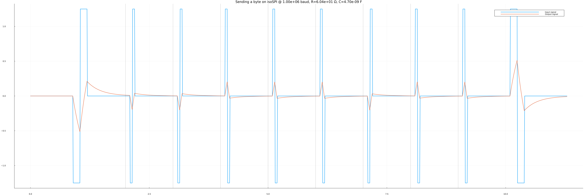
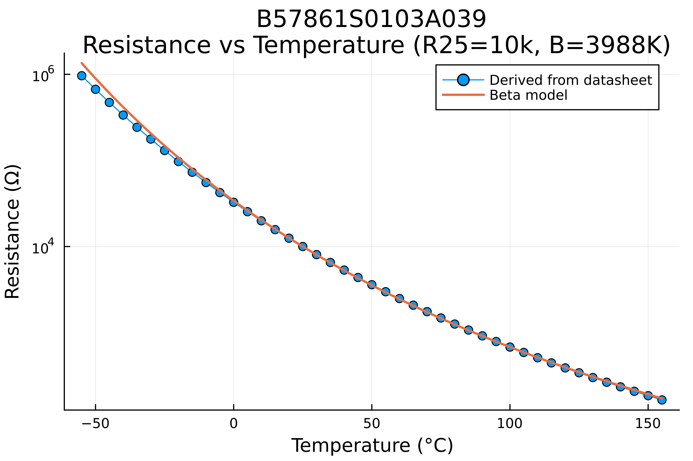
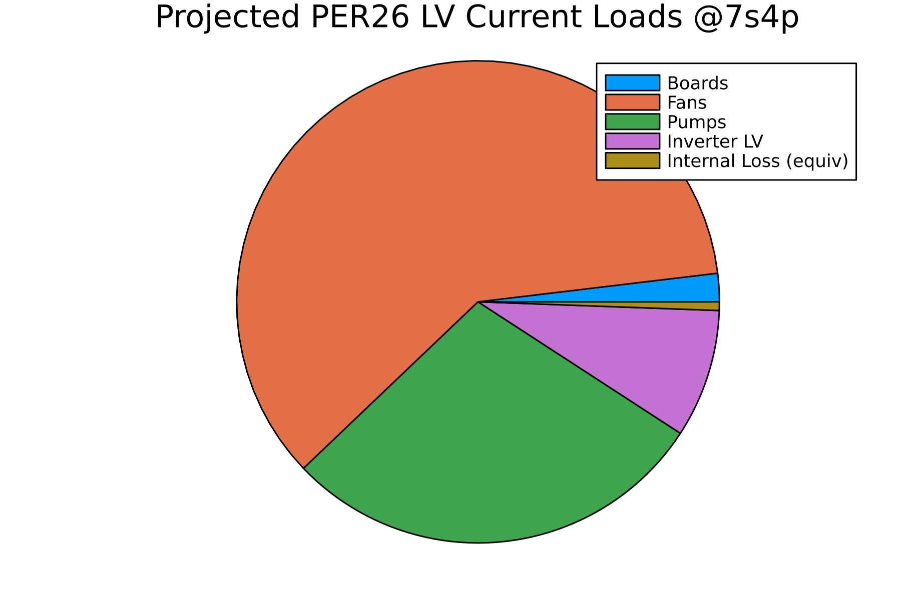

# electronics-models

We used the isoSPI model to catch a bug in our filtering circuit:

SDC Latch Simulation for open circuit detection:

SDC Latch when Preset RC Time constant is too small:

Thermistor modeling:

LV battery sizing:

- Runtime: 60.95 minute
- Sustained Total Current: 15.79 A
- Endurance factor of safety: 1.91
