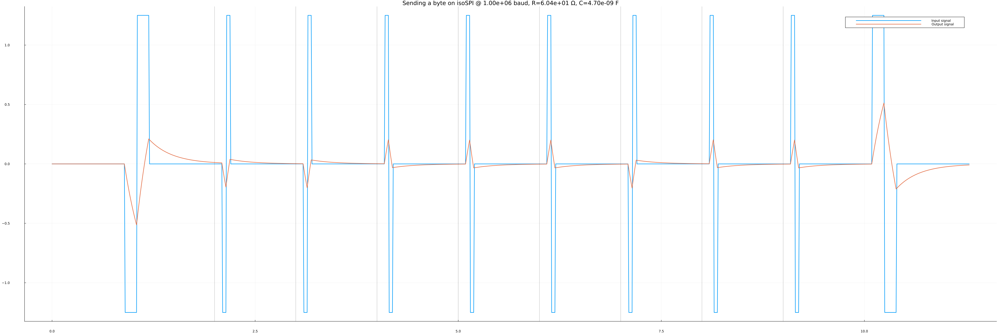
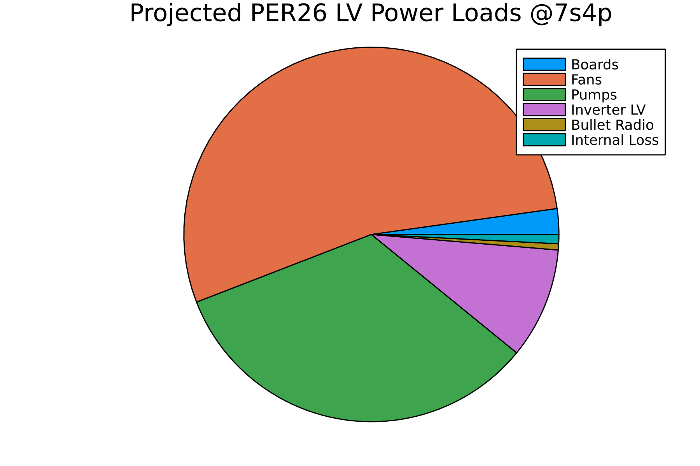
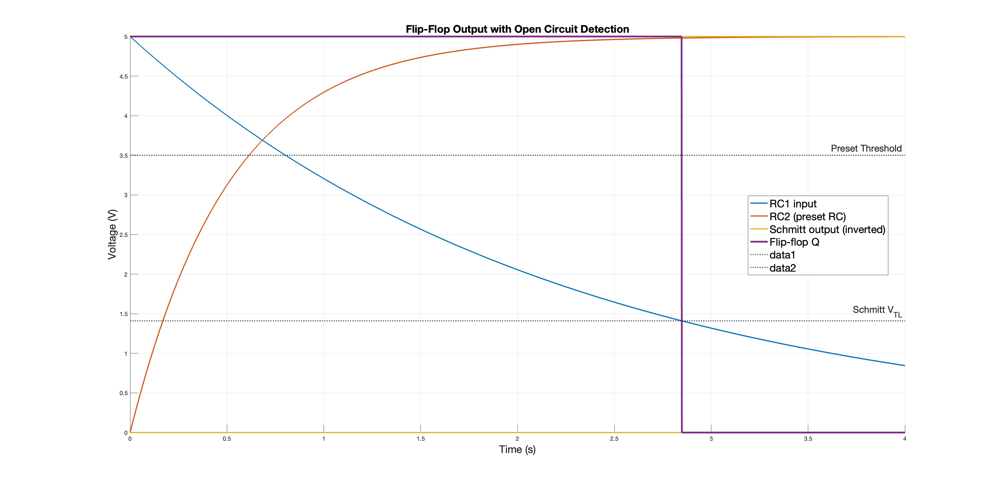
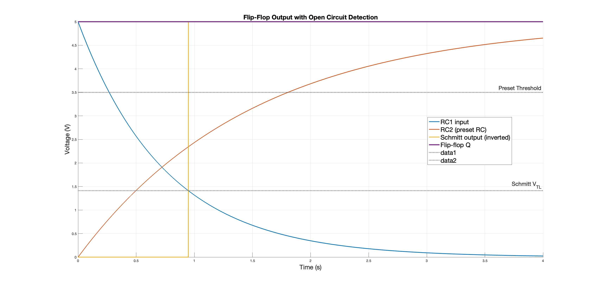
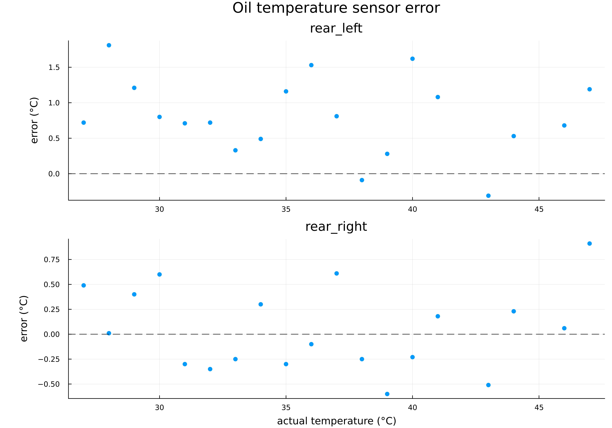

# PER Electrical Modeling

## Directory Structure
- `battery/`: Battery sizing and performance
- `circuits/`: Models of complete circuits
- `components/`: Data-driven or physics-based models of individual components/sensors
- `datasets/`: Raw data from bench testing and datasheets in xlsx/csv format
- `figures/`: Plots and images generated from the models
- `signals/`: Filtering and signal generation simulations

## Results
We used the isoSPI model to catch a bug in our filtering circuit:

LV battery sizing:

Runtime: 53.70 minute
Sustained Total Power: 451.60 W
Endurance factor of safety: 1.68

SDC Latch Simulation for open circuit detection:

SDC Latch when Preset RC Time constant is too small:

Thermistor modeling:

Oil temp sensor analysis:
